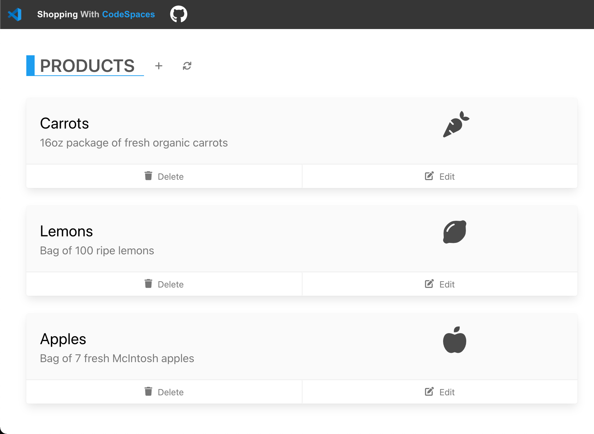
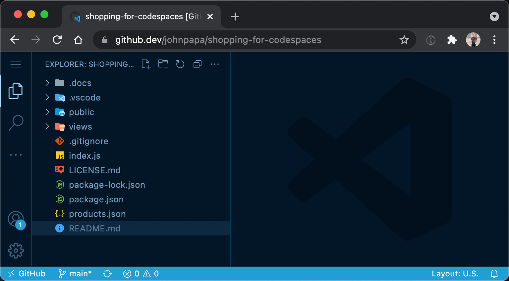
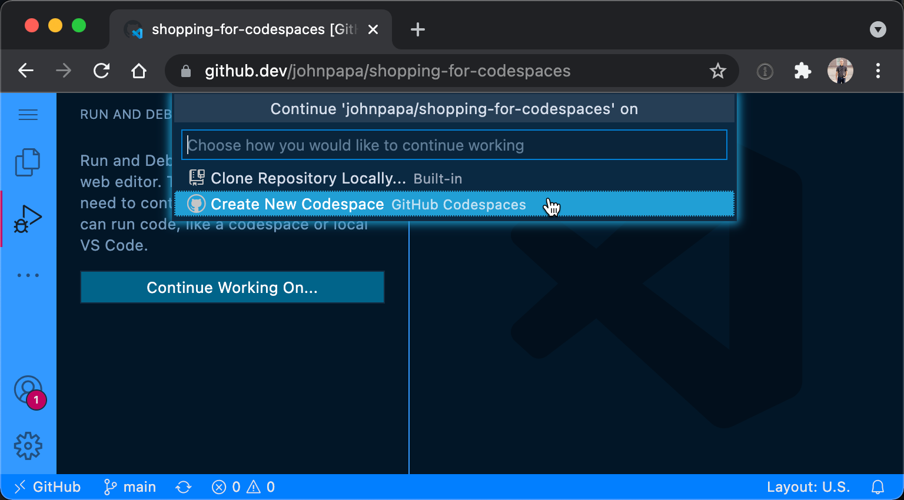
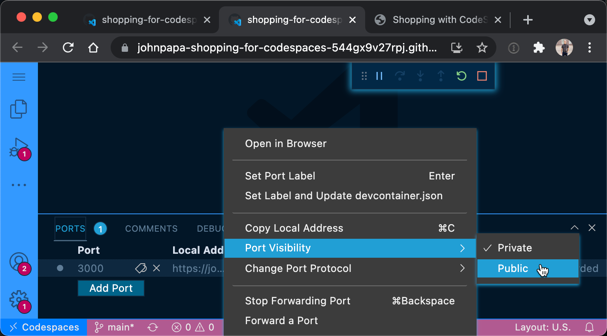
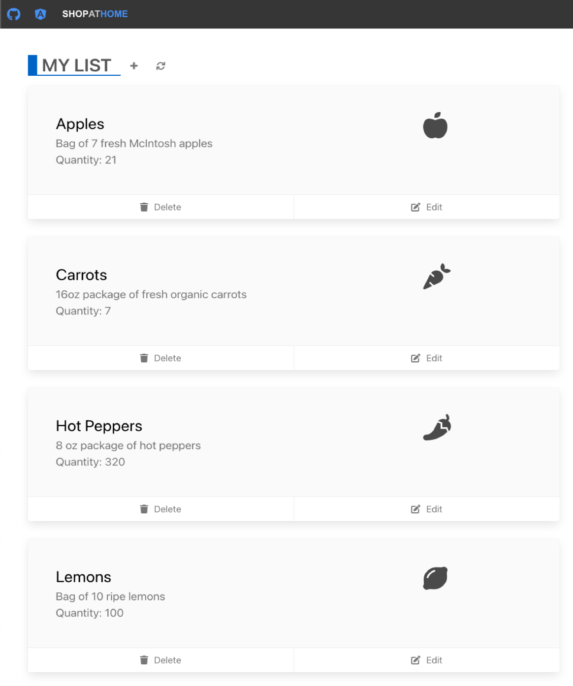

# Cloud Computing with Codespaces

First seen in the presentation **One More Change!** @ [NgConf 2022](https://2022.ng-conf.org/)

This is a project template for demonstrating github.dev, Codespaces, Co-pilot, Azure Static Web Apps, and Visual Studio Code.

## Top Features

- Start quickly with github.dev: a fast, free and lightweight VS Code editor in the browser
- Enjoy git integration to create branches and pull requests
- Continue working on Codespaces to build, run and debug
- Share your running app by forwarding ports
- Extend your code with GitHub Copilot
- Deploy your app to Azure Static Web Apps

## Setup

Before presenting this demo, be sure to create your own repository from the template, following these instructions:

1. <a target="_blank" href="https://github.com/johnpapa/ngconf-2022/generate">Generate your repository in your organization, by clicking here.</a>

   > This will open in a new tab where you can fill out the name and other details

1. Name your repository and continue

## Demo Story

Just One More Change ... It's a familiar story ...

You just received an urgent request from your project stakeholders to fix the web app. You need to jump directly into the project and correct a mistake where the site is selling a bag of a 1000 lemons when it's only supposed to be 10 per bag!

Compounding the urgency, you need to make the changes and you don't have the local development environment with Node.js and all of the required project dependencies. Not to worry though as you know you can use **github.dev** in the browser to make these changes.



### Adding the product in github.dev

1. Browse to the repository on GitHub at <https://github.com/johnpapa/ngconf-2022>.
1. Press `.` and the code instantly opens in **github.dev**, a fast and free lightweight VS Code editor in the browser.

    

   > Now you want to create your changes in separate branch and generate a new pull request.

1. Press `<F1>` to open the command palette.
1. Type and select `Create New Branch` and name it `fix/products`
1. Press `<ENTER>` and select `Switch to Branch` and `Leave Site` to refresh to the new branch.
1. Open the file containing the products in `product-data.js`.
1. Edit the description for lemons to the proper quantity of 10 per bag.

   ```json
      "description": "Bag of 1000 ripe lemons",
   ```

   to

   ```json
      "description": "Bag of 10 ripe lemons",
   ```

1. This is a simple change so you're comfortable to commit the file changes.

### Transition to Codespaces to build and run

> While you're editing the `product-data.js` file you are communicating with your stakeholders to let them know the change is being made. Since you're in there, they ask if you can add a new entry for a new product, hot peppers! Of course you can do this, but you'll feel more confident if you can build, run and view the app to verify that it works.

1. While in the same branch, open the file containing the products in `product-data.js`.
1. Add the missing product for hot peppers and save the file.

   ```javascript
    {
      id: 40,
      name: 'Hot Peppers',
      description: '8 oz package of hot peppers',
      quantity: 711,
      imageClass: 'fas fa-pepper-hot fa-3x'
    }
   ```

1. Now commit these changes.
1. You want to see the application run to make sure the hot peppers are displayed, so you open press `F1` and enter the command `View: Open Terminal` intending to build and run the app. Uh oh, there is no terminal!

   > So far we've been working entirely with the files in the browser. But now you need compute power to run the app and debug it. You can seamlessly transition from **github.dev** to the full power of compute in the cloud. Let's see how.

1. Press the button `Continue Working On ...` and then select `Create New CodeSpace` to be transitioned to Codespaces.

   > The browser refreshes and you're now working with compute resources which allow you to run, debug, and use the terminal all with the environment you need in the cloud. It even ran `npm install` to install your dependencies!

   > Note: You're using the default devcontainer for Node.js. You can create a custom devcontainer, by following the link in the terminal comments. But that's for another day.

    

1. Now let's run our Angular app with `npm run start` and our API with `npm run local`.

1. Select the `Ports` tab in the Terminal pane.

1. Our app is running on port 4280. Click the `globe` icon to browse to it. We're now building, running, and browsing to our app entirely in the browser in the cloud!

### Forward your ports publicly to your stakeholders to view them

1. Select the `Ports` tab in the Terminal pane.
1. Notice the visibility is set to `private` by default. You will right click and select `Port Visibility` and `Public`

   > Setting the port to public allows your stakeholders to see the app from the URL.

    

1. Now the URL can be shared with your stakeholders.

   > Your stakeholders review the running app and they're quite pleased ... until they notice that the products are not sorted in the proper ascending order by name. Uh oh, you're going to have to fix that! But you can't remember the exact syntax to sort the JavaScript array. Maybe GitHub Copilot can help you do this.

### Sort the products using the help of Copilot

1. Press `<F1>` to open Codespaces' command palette.
1. Select `View: Show Extensions`
1. Search for `GitHub Copilot`, press `Install`, and agree to the terms
1. Open the file `api/products-get/index.js` and put the cursor directly after the code gets the products.
1. Type `//` to engage with Copilot
1. Type `// sort the products by name in ascending order`, and hit `<TAB>` and `<ENTER>` to accept each line.
1. You're prompted line by line for the code to sort the products. It looks appropriate, so click `<ENTER>` on each line to accept it, until it is complete.
1. Comment the old line of code to render the products, now that you have replaced it.

   ```javascript
   const data = require('../shared/product-data');

   module.exports = async function (context, req) {
     try {
       const products = data.getProducts();
       // sort the products by name in ascending order
       products.sort((a, b) => {
         if (a.name < b.name) {
           return -1;
         }
         if (a.name > b.name) {
           return 1;
         }
         return 0;
       });

       context.res.status(200).json(products);
     } catch (error) {
       context.res.status(500).send(error);
     }
   };
   ```

1. Open the browser tab, refresh, and see your changes worked!

   > Copilot just helped you write the code to sort the products directly in Codespaces in the browser.

    

### Merge your changes

1. Stop your app (in the terminals).
1. Commit your changes and push them to the branch.
1. Create a new Pull Request.
1. Review, approve, and merge the pull request to the `main` branch.

### Optional - Deploy to Azure Static Web Apps

### Open the Codespace in your local install of VS Code

1. Click the `Codespaces` icon in the bottom left

1. Choose `Open in VS Code`

1. Accept the confirmation dialogs

> Now you are using VS Code locally to develop with your codespace!

### Recap

> Let's look back at what we were able to accomplish, all without having the local dev environment. You can edit files, create a new branch, and merge a PR all from **github.dev** in the browser. Then when you need a robust dev invironment to run your application, you can continue working on it in Codespaces. Here you can debug it and use tools like GitHub Copilot to help write the code your app needs, all from within the browser.
